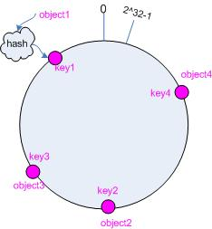
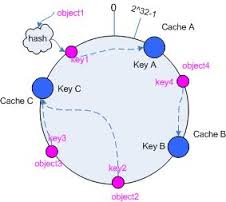

### 负载均衡和 hash 算法

分布式系统只，当服务增长到一定规模的时候，通常的做法是将服务器集群化，加入负载均衡。这样做的好处是：1.使服务达到高可用，2.解耦服务复杂度。从外部看，抽象了集群内部的细节。

假设一个场景：有四个 cache 服务器组成的集群叫做 `cache`，当一个对象的 object 传入集群的时候，这个对象应给存储在哪一个 cache 里面呢？一种简单的做法是映射公式。

`Hash(object) % 4`

这样就可以保证任何 object 都会尽可能随机落在其中一个 cache 中，运行正常。

然后我们需要考虑到一下情况：

  * 因为流量增大，我们需要增加一台 cache ，总共变成五个cache，这时映射公式就变成了 `Hash(object) % 5` 。
  * 或者其中有一个 cache 服务器宕掉了，变成了总共只有三台 cache 服务器可用。这时映射公式变成了 `Hash(object) % 3`。

可以见得，无论增加或者减少服务器节点，其映射公式均会发生改变，几乎所有的 object 都会重新映射到新的 cache 中，这意味着所有的缓存会全部失效。大量请求会直接发送到 web 应用层和 db 层面上，影响巨大。

所有我们需要有一个新的算法。

---
---

### 哈希一致性

哈希一致性的出现就是为了解决这个问题：当节点数量改变时，能够使失效的缓存数量尽可能少。

哈希一致性的基本思路就是分两步走：

  1. 根据 object 求 hash （与之前的第一步相同）；
  2. 把 cache 服务器也求 hash ，然后把 object 和 cache 的值放到同一个 hash 空间，通过一定的规则决定每个 object 落在哪一个 cache 中。

### 实现细节

> 成环

通常的 Hash 算法都是将 value 映射到一个 32 位的 key 值，也就是 0 ~ 2^32-1 的数值空间。我们将 key 值空间想象成一个首尾相接的圆环。

> 映射 object 到环上

假设有四个需要存储的 object ，先求出相应的 hash 值，根据 hash 值映射到环上。

> 映射 cache 到环上

假设有三台 cache 服务器,分别叫做 A, B, C 。用同样的方法求出 hash 值，映射到同一个环上。

> 按照规则匹配 object 到 cache 上。

让 object 在换上顺时针转动，遇到的第一个 cache 就是对应的 cache 服务器。

结果就是 object1 -> cache A, object2,object3 -> cache C, object4 -> cache B。

#### 解决问题

新的哈希一致性算法解决了 cache 服务器增减时 key 失效的问题。现在无论增减 cache 服务器，只会有一部分 key 失效。

假如我们要新加一台 cache 服务器 D,

cache D 服务器落在了 cache C 和 cache A 之间，那么失效的只有部分落在 cache A 服务器上的 key 了，现在变成落在 cache D 上了。cache B 和 cache C 上的 key 都没有失效。 

