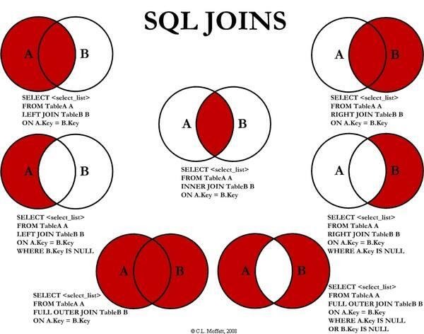

* distinct 去重取值
* limit offset limit 3, 4 第三个起取sige
* select (count * 4) select 可以直接进行四则运算
* concat 拼接结果
* group by 聚合函数 group by id 按照 id 来聚合结果
* inner join 如果表中至少有一个匹配，则返回行, 取两表交集。
* left join 即使右表中没有匹配，也从左表中返回行，取左表的完全集+右表匹配集，没有匹配则取 null 值。
* right join 及时左表中没有匹配，也从右表中返回行，取右表的完全集+左表匹配集

  

* union 合并两个或多个 SQL 语句结果集,默认已去重
  ```sql
  SELECT column_name(s) FROM table1
  UNION
  SELECT column_name(s) FROM table2;
  ```

* having 筛选分组后的各组数据，避免 where 子句无法使用聚合函数的原因
  
  ```sql
  ELECT Websites.name, Websites.url, SUM(access_log.count) AS nums FROM (access_log
  INNER JOIN Websites
  ON access_log.site_id=Websites.id)
  GROUP BY Websites.name
  HAVING SUM(access_log.count) > 200;
  ```

* 事务

  控制语句

  显式开启一个事务
  ```sql
  BEGIN 
  # OR 
  START TRANSACTION 
  ```
  
  提交事务
  ```sql
  COMMIT
  ```

  回滚事务
  ```sql
  ROLLBACK
  ```

* 字段类型

* RANK 
