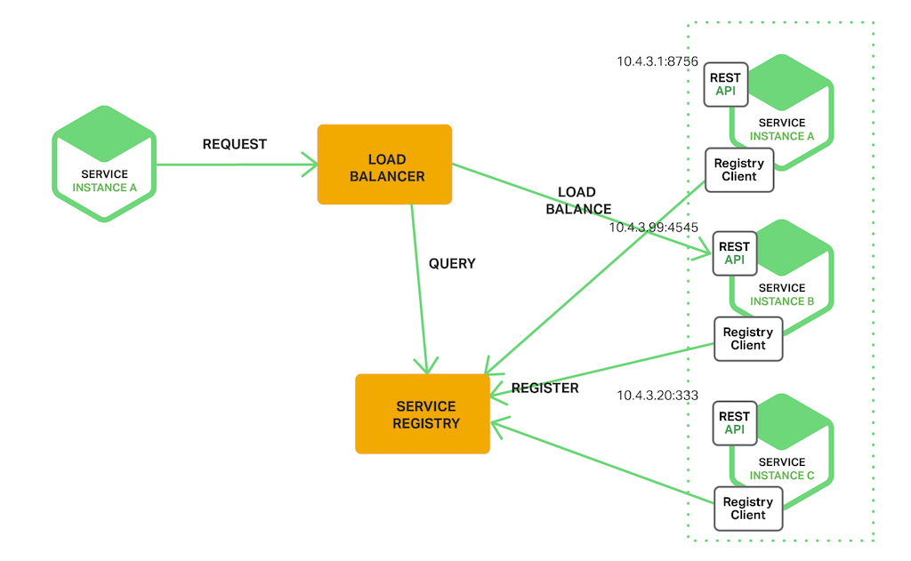

## 为什么使用服务发现

使用 restful 或者 thrift api 调用某些服务。为了发送请求，代码层面需要知道服务的网络地址（端口 + IP）。传统应用运行在物理网络上，网络地址相对静态，调用方只需要从配置文件读取服务网络地址即可。

微服务体系下与传统应用有较大区别。

> 参见下图

看起来非常 'dynamically'

## 客户端（调用方）服务发现模式

当使用客户端服务发现模式的时候，有调用方来决定可用服务的地址，然后通过负载均衡来访问服务。调用方会查找一个服务注册表，表中存着可正常使用的服务实例列表。客户端会使用负载均衡算法来选择其中的一个可正常使用的服务实例来做请求。

> 见下图

服务实例的网关地址自启动的时候就会注册到服务注册表中，服务中止时则会从服务注册表中删除。服务注册表会使用心跳机制周期性的刷新。

[Netflix OSS](https://netflix.github.io/) 提供了一个很棒的客户端服务发现模型。[Netflix Eureka](https://github.com/Netflix/eureka) 是一个服务注册器，它提供 REST api 来管理服务实例的注册和查询可供使用的服务实例。[Netflix Ribbon](https://github.com/Netflix/ribbon) 是一个进程间通信工具，为 Eureka 提供负载均衡工作，分发请求到可用容器上。

客户端服务发现模式有种种优势和劣势。这个模型相对简单，除了服务注册之外，没有其他灵活的部分。并且，自从客户端知道了可工作服务实例之后，可以使用哈希一致性来做更加明智的，更具应用偏好（业务偏好？）的负载均衡选择。有一个很重要的缺点是关于客户端和服务注册之间的串联，必须为每一种编程语言或者框架来实现它们自己的服务客户端。

---
---

## 服务端发现模型

另外一种服务发现模型就是服务端发现模式。

> 见下图

调用方从负载均衡器想服务方发送请求。负载均衡器查找服务注册表，然后路由每个请求到可用的服务实例上。与调用方服务发现模式一样，服务实例的注册和注销均由服务注册表来完成。

AWS ELB 可以作为一个服务端发现的路由。ELB 经常被用作负载均衡器来转发从互联网过来额外的流量。然而，你也可以使用 ELB 来负载均衡 VPC 虚拟内网里的流量。调用方通过 ELB 的 DNS 域名发送HTTP或者TCP请求，ELB 会负载均衡流量到一组已被注册的 EC2/ECS 实例中。这个模式中并非只有一个服务注册表，取而代之的是，EC2实例和 ECS 容器组都会被 ELB 自身注册。

类似 NGINX 的 HTTP 服务器和负载均衡器也可以作为一个服务端服务发现负载均衡器。举个例子来讲，这篇[文章](https://www.airpair.com/scalable-architecture-with-docker-consul-and-nginx) 使用了 Consul  Template 来动态配置 NGINX 反向代理路由。Consul Template 是一个从 Consul 服务注册表周期性生成配置文件的工具。当配置文件发生改变时，它会武断的运行一个 shell 命令。这个文章中，Consul Template
会动态生成一个 `nginx.conf` 文件，用来配置反向代理，然后它会运行一条命令来通知 NGINX 服务器重载配置文件。有个更加老道的做法是通过[its HTTP API or DNS](https://www.nginx.com/products/on-the-fly-reconfiguration/)能够动态重载 NGINX Plus 。
一些部署环境会用到 Kubernetes 和 Marathon 来代理集群中的每个主机。这个代理的作用类似于服务端服务发现机制中的负载均衡。为了发送一个请求到一个服务，调用方必须通过代理请求服务的 ip 地址和可用端口。代理显然会转发请求到集群中可用服务实例上。

服务端服务发现机制同样也有一些优缺点。一个显而易见的优点是，这个模式中服务发现机制对于调用方抽象了很多细节。调用方只要简单的发送请求到负载均衡器即可。这个优点排除了调用方服务注册与发现机制中，需要为每个编程语言或者框架实现一套服务发现逻辑这一缺点（这句好长。。。）。需要提及的是，部分部署环境免费提供了这项功能。这和模式也有部分缺点，除非部署环境自己提供了负载均衡器，否则自己需要折腾另外一套高可用的系统部件来配置和管理。

---
---

## 服务注册表

服务注册表是服务注册体系中较为关键的一部分。它是一个存储着服务实例网络地址的数据库。一个服务注册表需要做到高可用和及时更新。调用方会缓存从服务注册表取得的网络地址。然而这些信息最终会过期知道调用方没办法再发现服务实例。因此，一个服务注册表由一系列用到了分片协议来保持一致性的服务集群组成。

实现安利一下，Netflix Eureka 是一个很好的服务注册表示例。它提供了 REST 接口供注册和查询服务实例。使用 POST 请求发送服务实例的网关地址来注册服务。每隔三十秒它必须使用 PUT 请求刷新注册。使用 DELETE 请求可以删除一个注册的实例，或者等到服务实例超时也可以删除。如你所料，调用方可以通过 GET 请求来获得已注册的服务实例。

---
---

## 自注册模式

...

---
---

## 第三方注册模式

...

---
---

## 总结

